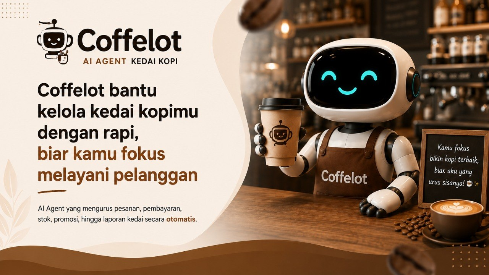

# Coffeelot

**AI Business Intelligence & Operations Agent for Coffee Shops / Small F&B**

Coffeelot combines a built-in POS, customer self-order, DOKU payment integration, inventory control, booking/seat availability, kitchen queue, and LLM-powered agent workflows into one operational intelligence layer for coffee shop owners.

> From daily transactions to autonomous operational intelligence.



## Live Demo

- POS: <https://coffeelot.app/>
- Customer self-order: <https://coffeelot.app/chat>
- Agent dashboard: <https://coffeelot.app/agent>
- API health: <https://api.coffeelot.app/api/health>

## Submission Package

- 5-slide pitch deck source: [`docs/reports/COFFEELOT-PITCHDECK-5SLIDES.md`](docs/reports/COFFEELOT-PITCHDECK-5SLIDES.md)
- Pitch deck PDF: [`docs/reports/OpenClaw2026_Coffeelot_Coffeelot.pdf`](docs/reports/OpenClaw2026_Coffeelot_Coffeelot.pdf)
- Demo video script: [`docs/reports/COFFEELOT-VIDEO-SCRIPT.md`](docs/reports/COFFEELOT-VIDEO-SCRIPT.md)
- Devpost submission draft: [`docs/reports/DEVPOST-SUBMISSION.md`](docs/reports/DEVPOST-SUBMISSION.md)
- AI tools/models list: [`docs/reports/AI-TOOLS-MODELS.md`](docs/reports/AI-TOOLS-MODELS.md)

## What Coffeelot Does

### Commerce

- Built-in POS product grid and checkout.
- Customer `/chat` self-order flow for QR/table ordering.
- DOKU sandbox payment integration for QRIS, VA BCA, and Checkout-style payment flows.
- Kitchen/barista queue with prep status updates.

### Operations

- Inventory items and product recipes.
- Paid-order recipe stock deduction.
- Insufficient-stock guard before payment creation.
- Projected cart stock in POS and `/chat`.
- Booking/seat availability guard using overlapping reservation windows.
- Payment reconciliation fallback for pending DOKU payments.

### AI Agent / Business Intelligence

Coffeelot includes an agent workflow runner with persisted runs and outputs. Workflows can run on demand, by schedule, or from operational events.

Current workflows:

1. `daily_report`
2. `restock_alert`
3. `risk_detection`
4. `promo_generation`
5. `morning_briefing`
6. `booking_seat_insight`
7. `menu_engineering`
8. `demand_forecast`
9. `prep_planning`
10. `kitchen_sla`
11. `payment_reconciliation_insight`

The `/agent` dashboard shows workflow controls, agent timeline, structured LLM insight cards, approval controls for promo outputs, booking insight cards, and an insight comparison table explaining when each insight is used and what data it processes.

## Tech Stack

- Runtime/package manager: Bun
- Language: TypeScript
- Backend: Elysia.js
- Frontend: React + Vite
- Database: SQLite + Prisma ORM
- Shared types: TypeScript workspace package
- Main AI runtime: OpenClaw agent runtime + GPT-5.5 via OpenAI-compatible Chat Completions API
- Payment: DOKU MCP sandbox integration
- QR rendering: `qrcode.react`
- Deployment: systemd services behind Nginx Proxy Manager

## Repository Structure

```text
coffeelot-ai/
├── apps/
│   ├── api/              # Elysia backend API
│   └── web/              # React/Vite frontend
├── packages/shared/      # Shared domain constants/types
├── prisma/               # Prisma schema, migrations, seed data
├── docs/                 # Architecture, API, order channels, reports
├── scripts/              # Utility scripts
├── README.md
├── PROJECT_STATUS.md
├── ROADMAP.md
├── TODO.md
└── CHANGELOG.md
```

## Local Setup

### Prerequisites

- Linux/macOS shell
- Bun 1.x or newer
- Git

Install Bun if needed:

```bash
curl -fsSL https://bun.sh/install | bash
```

### 1. Clone

```bash
git clone git@github.com:yudhamaulanaa/OpenClaw2026_Coffeelot_Coffeelot.git
cd OpenClaw2026_Coffeelot_Coffeelot
```

If the repository is renamed for the hackathon requirement, use:

```bash
git clone git@github.com:yudhamaulanaa/OpenClaw2026_Coffeelot_Coffeelot.git
cd OpenClaw2026_Coffeelot_Coffeelot
```

### 2. Install dependencies

```bash
bun install
```

### 3. Configure environment

```bash
cp .env.example .env
```

For local reproducible judging without external services, the app can run with empty DOKU/AI credentials. AI workflows will use deterministic fallback when no AI provider is configured, and payment creation will use fallback behavior when DOKU MCP is unavailable.

Recommended local `.env` values:

```bash
DATABASE_URL="file:./prisma/dev.db"
API_HOST="127.0.0.1"
API_PORT="3001"
VITE_API_BASE_URL="http://127.0.0.1:3001/api"
DEMO_TENANT_ID="demo-tenant-kopi-jagoan"
DEMO_OUTLET_ID="demo-outlet-booth-ciputat"
AGENT_SCHEDULER_ENABLED="false"
AGENT_EVENT_TRIGGERS_ENABLED="true"
DOKU_CALLBACK_SIGNATURE_REQUIRED="false"
BOOKING_DEFAULT_SEAT_CAPACITY="24"
BOOKING_DEFAULT_HOLD_MINUTES="90"
```

Optional AI provider config:

```bash
AI_BASE_URL="https://your-openai-compatible-provider/v1"
AI_API_KEY="your-api-key"
AI_MODEL="your-model"
AI_TIMEOUT_MS="60000"
```

Optional DOKU sandbox config:

```bash
DOKU_ENV="sandbox"
DOKU_CLIENT_ID="your-doku-client-id"
DOKU_API_KEY="your-doku-api-key"
DOKU_SECRET_KEY="your-doku-secret-key"
DOKU_MCP_URL="https://api-sandbox.doku.com/doku-mcp-server/mcp"
DOKU_CALLBACK_URL="http://127.0.0.1:3001/api/payments/callback"
DOKU_RETURN_URL="http://127.0.0.1:5173"
```

Never commit real secrets.

### 4. Prepare database

```bash
bun run db:generate
DATABASE_URL="file:./prisma/dev.db" bunx prisma migrate deploy
DATABASE_URL="file:./prisma/dev.db" bun run db:seed
```

For development migration creation, use:

```bash
DATABASE_URL="file:./prisma/dev.db" bunx prisma migrate dev
```

### 5. Run backend and frontend

Terminal 1 — API:

```bash
DATABASE_URL="file:./prisma/dev.db" bun run --cwd apps/api dev
```

Terminal 2 — Web:

```bash
VITE_API_BASE_URL="http://127.0.0.1:3001/api" bun run --cwd apps/web dev
```

Open:

- POS: <http://127.0.0.1:5173/>
- Customer order: <http://127.0.0.1:5173/chat?table=A1&name=Demo>
- Agent dashboard: <http://127.0.0.1:5173/agent>
- API health: <http://127.0.0.1:3001/api/health>

## Verification

```bash
bun run typecheck
bun run build
```

Useful API checks:

```bash
curl http://127.0.0.1:3001/api/health
curl -H 'x-tenant-id: demo-tenant-kopi-jagoan' \
     -H 'x-outlet-id: demo-outlet-booth-ciputat' \
     http://127.0.0.1:3001/api/agent/workflows
```

Run an agent workflow:

```bash
curl -X POST http://127.0.0.1:3001/api/agent/runs \
  -H 'content-type: application/json' \
  -H 'x-tenant-id: demo-tenant-kopi-jagoan' \
  -H 'x-outlet-id: demo-outlet-booth-ciputat' \
  -d '{"workflow_id":"daily_report","trigger_type":"on_demand"}'
```

## Demo Flow for Judges

1. Open `/` and show POS, cart, projected stock, and kitchen queue.
2. Open `/chat?table=A1&name=Demo` and show customer self-order/payment flow.
3. Open `/agent` and run or review AI workflows.
4. Show Insight Comparison table with context: when each insight is used and what data it processes.
5. Highlight Booking Seat Insight and BI workflows such as Menu Engineering, Demand Forecast, Kitchen SLA, and Payment Reconciliation Insight.

## AI Tools / Models

See [`docs/reports/AI-TOOLS-MODELS.md`](docs/reports/AI-TOOLS-MODELS.md).

## Security Notes

- Runtime credentials are not committed.
- `.env.example` contains placeholders only.
- DOKU callback signature validation is implemented for public callback hardening.
- Local fallback modes exist so judges can reproduce the app without secret credentials.

## License

Hackathon/MVP prototype. License to be finalized.
